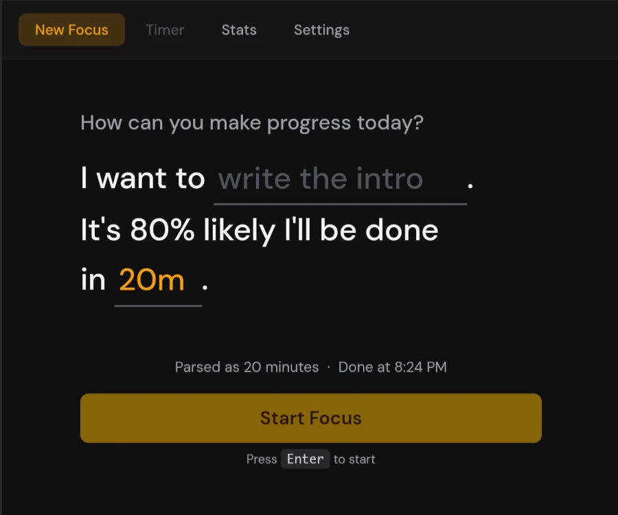
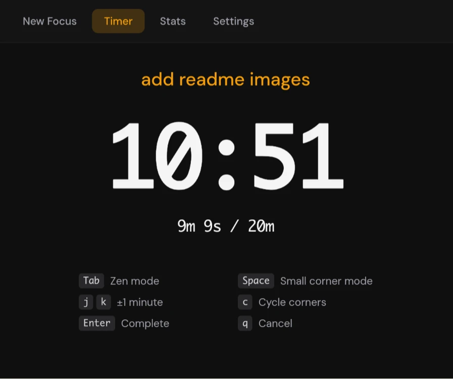
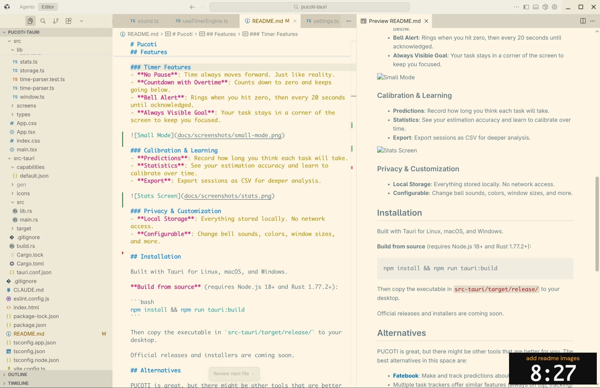
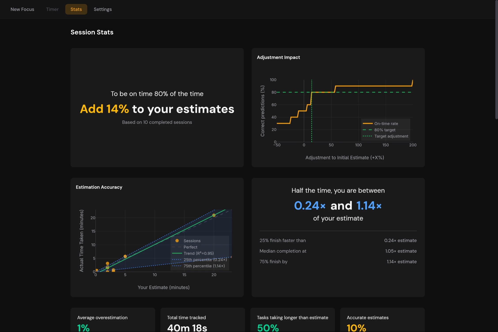

# Pucoti

Stay on task with PUCOTI, a countdown timer built for simplicity, purpose, and overcoming the planning fallacy.

<div align="center">
  
</div>

## Why Pucoti?

Most of us are terrible at estimating how long tasks will take. Pucoti helps you build calibration by tracking your predictions against reality. It also keeps you focused on a single task by displaying your goal in the corner of the screen at all times—no forgetting what you're supposed to be doing.

## Features

<div align="center">
  
</div>

### Timer Features
- **No Pause**: Time always moves forward. Just like reality.
- **Countdown with Overtime**: Counts down to zero and keeps going below.
- **Bell Alert**: Rings when you hit zero, then every 20 seconds until acknowledged.
- **Always Visible Goal**: Your task stays in a corner of the screen to keep you focused.



### Calibration & Learning
- **Predictions**: Record how long you think each task will take.
- **Statistics**: See your estimation accuracy and learn to calibrate over time.
- **Export**: Export sessions as CSV for deeper analysis.



### Privacy & Customization
- **Local Storage**: Everything stored locally. No network access.
- **Configurable**: Change bell sounds, colors, window sizes, and more.

### GNOME Panel Indicator (Linux)


On GNOME, Pucoti can show timer status in the top panel. The extension is included with deb/rpm packages. After installing, log out and back in, then enable it in Settings → "Minimize window" on timer start.

## Installation

Download the latest release from [GitHub Releases](https://github.com/ddorn/pucoti-tauri/releases).

### Linux

**Debian/Ubuntu (.deb)**:
```bash
sudo apt install ./Pucoti_*_amd64.deb
```

**Fedora/RHEL/openSUSE (.rpm)**:
```bash
sudo rpm -i Pucoti-*.x86_64.rpm
```

### Windows

Download and run `Pucoti_*_x64_en-US.msi`. Follow the installation wizard.

### macOS

Installing on macOS requires some extra steps before opening the app for the first time, as the app is not signed. Open a terminal and run the following commands.

**Download for Apple Silicon (M1/M2/M3)**:
```bash
curl -L -o Pucoti.tar.gz https://github.com/ddorn/pucoti-tauri/releases/latest/download/Pucoti_aarch64.app.tar.gz
```

**Download of Intel**:
```bash
curl -L -o Pucoti.tar.gz https://github.com/ddorn/pucoti-tauri/releases/latest/download/Pucoti_x64.app.tar.gz
```

Then extract, install, remove the quarantine bit, and launch:
```bash
tar -xzf Pucoti.tar.gz
mv Pucoti.app /Applications/
xattr -cr /Applications/Pucoti.app
open /Applications/Pucoti.app
```

If you still encounter permission issues, see: https://wiki.hacks.guide/wiki/Open_unsigned_applications_on_macOS_Sequoia_and_newer

### Build from Source

Requires Node.js 18+ and Rust 1.77.2+:

```bash
npm install && npm run tauri:build
```

The executable will be in `src-tauri/target/release/`.

**GNOME extension (manual install):**
```bash
./gnome-extension/install.sh
# Log out and back in, then:
gnome-extensions enable pucoti@pucoti.dev
```

## Alternatives

PUCOTI is great, but there might be other tools that are better for you. The best alternatives in this space are:
- **[Fatebook](https://fatebook.io/)**: Make and track predictions about anything.
- Multiple task trackers offer similar features (always on top, tracking) but little calibration tools: **[Amazing Marvin](https://amazingmarvin.com/)**, **[Superproductivity](https://super-productivity.com)**

Open an issue if you know others!


## Acknowledgments

A huge thanks to [Felix](https://github.com/felixdorn) for reporting so many things while beta testing and the extremely helpful feedback.

Thanks to [Lucie](https://github.com/Aelerinya) for creating a nice gnome extension, testing and debugging.

## License

MIT
